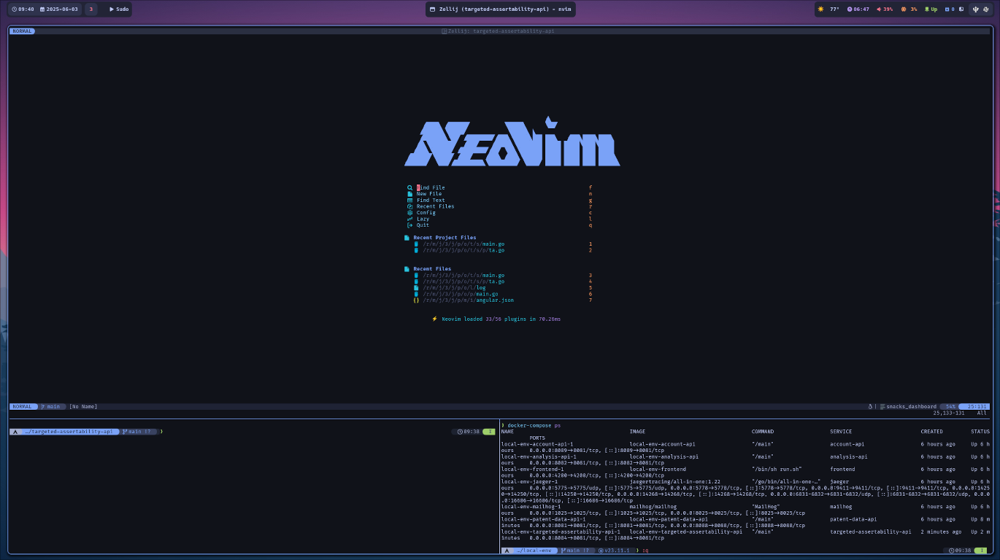

# Theoretically My Configs (WIP)
> The configuration files for my setup. May not always be up to date. Make sure you understand what a config does before you use it. 

OS:
- [Arch](https://archlinux.org/) (btw)

Window Management:
- [Hyprland](https://hyprland.org/)

Dev tools:
- [Neovim](https://neovim.io/)
- [Zellij](https://zellij.dev/)
- [Wezterm](https://wezterm.org/index.html)
- [Lazygit](https://github.com/jesseduffield/lazygit)
- [Lazydocker](https://github.com/jesseduffield/lazydocker)

## Hyprland
I configured hyprland to swap the esc and capslock keys. It make neovim much nicer. I also have few keybinds to open a terminal, web browser, etc.

## Neovim
You can check out the list of all plugins I use or have [here](https://github.com/theoreticallyjosh/dots/tree/main/.config/nvim/lua/plugins).

### Plugins of Note
Here is a list of plugins that I think are useful for anybody regardless of there development stack, or even if you aren't editing code.

| Plugin | Comments |
| [zellij-nav.nvim](https://git.sr.ht/~swaits/zellij-nav.nvim) | It makes it easier to navigate between neovim and zellij panes. |
| [harpoon](https://github.com/ThePrimeagen/harpoon/tree/harpoon2) | Buffer navigation. Great for quickly jumping between a few files |
| [telescope](https://github.com/nvim-telescope/telescope.nvim) | Fuzzy file searching and more |
| [oil.nvim](https://github.com/stevearc/oil.nvim) |"...file explorer that lets you edit your filesystem like a normal Neovim buffer." |
| [flash.nvim](https://github.com/folke/flash.nvim) | Makes navigating in a buffer easier |

## Zellij
I use zellij's tmux mode a majority of the time. I also swapped the leader <ctrl-b> with <ctrl-a>. I chose it because atmux's panes didn't scale correctly when opening an existing session on a smaller window. (At least at the time) Also I really like being able to create templates.

### Dev Template
My dev template consists of 3 panes. The main one being for neovim. At the bottom I have to panes for terminals. One for the cwd and the other for directory where I am running docker-compose.

### Special Keybinds
I have a few custom keybinds to open floating panes for:

| Pane | keybind |
| ---- | ------- |
| Lazydocker | \<alt-d\> |
| Lazygit | \<alt-g\> |
| Ollama | \<alt-a\> |
| Gemini | \<alt-i\> |

## Wezterm
The only change I made in the config is appearance related e.g. the background for the Tokyo Night theme darker. In the future I would utililize more of it's features to perhaps replace zellij. Not convinced I can/should yet.

# Things to add
- [ ] Hypr ecosystem
- [ ] Rofi
- [ ] Waybar
- [ ] Fish
- [ ] Mako
- [ ] Logseq
- [ ] Starship
- [ ] Custom scripts
- [ ] rmpc

## Meta

TheoreticallyJosh (Joshua Hagofsky) – [@theoreticjosh](https://twitter.com/theoreticjosh) – theoreticallyjosh@gmail.com

Distributed under the MIT license. See ``LICENSE`` for more information.

[https://github.com/theoreticallyjosh/dots](https://github.com/theoreticallyjosh/)

<!-- Markdown link & img dfn's -->
[Website]: https://theoreticallyjosh.com
